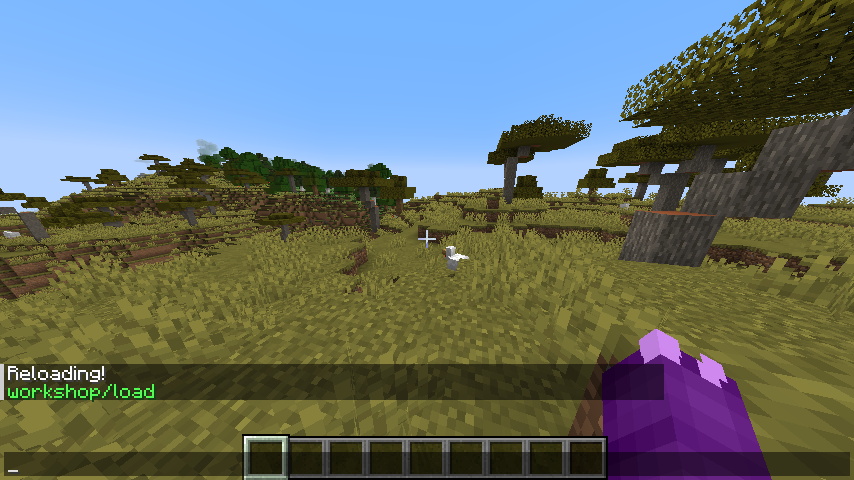
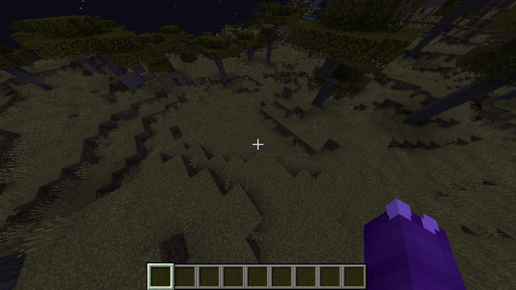
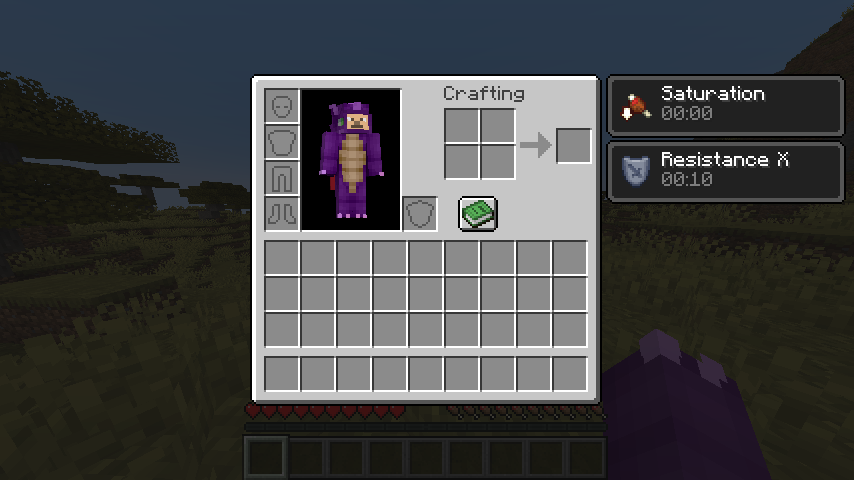
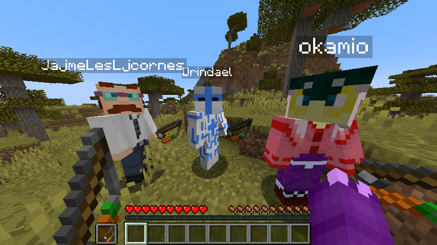
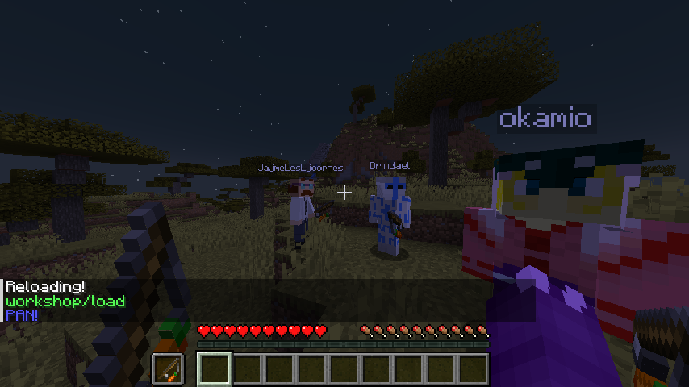
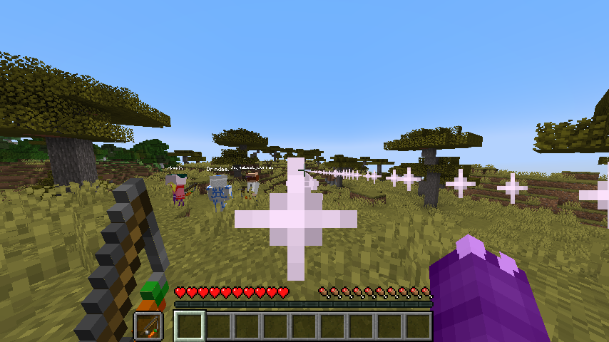
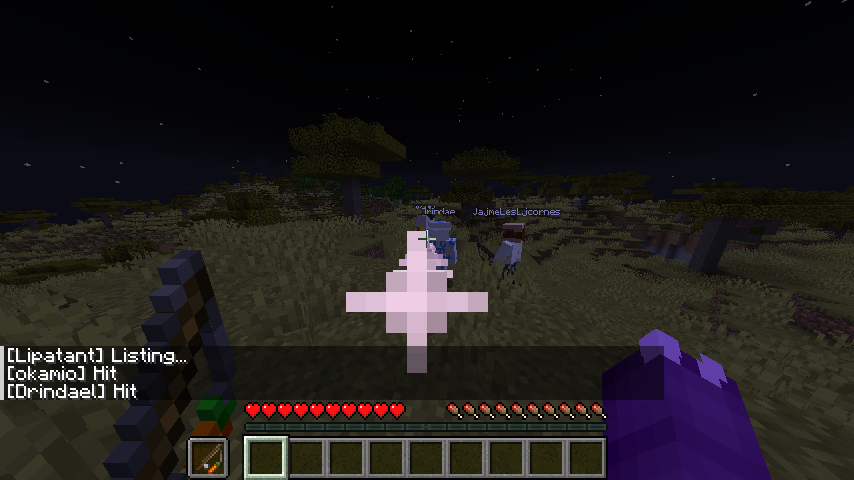

# WorkshopDatapackMinecraftAdvanced

## Before that

During this Workshop, I will assume that you've done the [previous workshop](https://github.com/Lipatant/WorkshopDatapackMinecraft), and that you understand everything from step 1 to 5.

If you haven't done or finished this one, I highly encourage you to complete it before. If you need any help for that, we're still here to help you.

## Let's jump back to our datapacks

It's been so long, isn't it?

During this Workshop, we'll make a minigame. For that, we'll need to encapsulate player actions.

For the multiplayer part, you have 3 main ways of testing:

- You can use the [Carpet mod](https://www.curseforge.com/minecraft/mc-mods/carpet) for [Fabric](https://fabricmc.net/). It will add a `/player` command spawning and managing fake players.
- You can make your world opened to LAN so another student can join you for testing purposes.
- You can open another Minecraft with a different account, on a different `.minecraft` directory, then making your world opened to LAN.

First, use the new datapack template named `WorkshopDatapackAdvanced` from this repository.

Now you can make a new Minecraft save and import the datapack.

A `/reload` and we can check if everything works...



Amazing!

## Rule of Nature

### Gamerule

Inside our `load` function, we'll overwrite some gamerules everytime we use `/reload`.

We'll need to change the following rules :
- Mobs will **not** naturally **spawn**
- Players will keep their **inventory** upon death
- Players will respawn **immediately** upon death
- Entities will **not** take any **fall damage**

Nothing changed : `/help gamerule` and the wiki are your friends ([Commands/gamerule](https://minecraft.wiki/w/Commands/gamerule) and [Game_rule](https://minecraft.wiki/w/Game_rule)).

After that and two `/kill @e[type=!player]`, no entity (other than the players) should remain.



## The Unkillable Soldier

### Effects

Since we want to implement our own health system, we'll have to get rid of damage.

Inside our `tick` function, we'll apply a **Resistance** effect to all players. I advise you to apply it a level of 10 and for a duration of 1 second.

And now, we'll do the same for filling our **hunger** level. I advise you, this time, to apply it a level of only 1 and for a duration of 19 ticks.

(`/help effect`, [Commands/effect](https://minecraft.wiki/w/Commands/effect) and [Effect](https://minecraft.wiki/w/Effect))



We are now a strong dragon!

## Owner Of A Lonely Heart

### Tags

We'll do something important for later, right now.

Have you ever heard of Minecraft tags? It's a way of placing reminders on entities.

Here, we'll add a `Player` tag on the ones playing. That only includes players in Adventure mode.

Inside our `tick` function (again), we'll add our `Player` tag to valid players, and remove it from others.

(`/help tag`, [Commands/tag](https://minecraft.wiki/w/Commands/tag))

Now that our tags are active, we'll make that our previous effects are only applied to those with the `Player` tag.

([Target selector arguments](https://minecraft.wiki/w/Target_selectors#Target_selector_arguments))

### Item

Using the `item` command, we'll place into our players' hands a `Carrot on a Stick`, in the offhand.

Why? Because Carrots on a Stick can be used to detect right clicking. We want to force the player to have one every tick.

(`/help item` and [Commands/item](https://minecraft.wiki/w/Commands/item), and we'll use the `item replace entity` part of the command)



### tick/player

Nothing complicated, just a little bit of refactoring here.

Our code will soon become more complex, so we're planning ahead.

Create a new function: `workshop:tick/player`.

With the execute command, make that every `tick`, this new function is used as and at every player carrying the `Player` tag.

After that, we'll move our **Effects** and **Tags** code into this new function and we'll replace the selected entities by self selectors.

(`/help execute` and [Commands/execute](https://minecraft.wiki/w/Commands/execute))

## Nüguns

Now's the fun part! 😈

### UseItem

Go into your `load` function and add the following line:

```
scoreboard objectives add actionUseItem minecraft.used:minecraft.carrot_on_a_stick
```

This will create, when reloading our datapack, a new scoreboard named `actionUseItem` that will be automatically incremented whenever the entity uses a Carrot on a Stick.

Now, at the end of `tick`, when can reset this scoreboard back to `0`.

Create a new function: `workshop:player/action/use_item`.

Inside, add a `tellraw` to display a message with a self selector.

We can now go back to our `workshop:tick/player` and make that if our `actionUseItem` scoreboard is **above** `0`, it will call our new function.



Pressing our right click should display our message.

### Raycasting (yes)

Scary word but simple, trust me!

We'll start by making new scoreboards:

```
scoreboard objectives add function dummy
```

This new `function` scoreboard will be used for temporary values.

Create a new function: `workshop:player/shoot` then call it from `workshop:player/action/use_item`

Then, in our new function:

- Remove a `Self` tag from all players and add it back to our player.
- Set `%rangeRemaining`'s `function` scoreboard to 50000 (50 blocks **x** 1000, for precision). Here, `%rangeRemaining` is a fake players: it cannot exist because of `%`.

Create a new function: `workshop:raycast/new` then call it from `workshop:player/shoot`

Create a new function: `workshop:raycast/segment` then call it from `workshop:raycast/new` but positioned at the player's eyes

(`/help execute` and [Commands/execute](https://minecraft.wiki/w/Commands/execute))

Now, inside `workshop:raycast/segment`:

- Remove 200 from `%rangeRemaining`'s `function` scoreboard (0.2 blocks **x** 1000)
- If `%rangeRemaining`'s `function` is **not** greater or equal to 0, exit the function
- Plays a particle of your choice, with no speed (in the follow screenshot, I used `wax_off`)
- Call `workshop:raycast/segment` (itself) but positioned 0.2 blocks further

You should now have raycast everytime you press your right click.



## Last Man Standing

### Hit

Now, let's add damage!

Go to `workshop:raycast/new` and, at the start of the function, remove the `Hit` tag from all players

Then, go to `workshop:raycast/segment` and this complex command:

```
execute positioned ~-0.3 ~-0.1 ~-0.3 as @a[dx=0,tag=Player,tag=!Self] positioned ~-0.39 ~-0.79 ~-0.39 if entity @s[dx=0] run tag @s add Hit
```

This will detect if the current position is inside a `Player`'s hitbox (not `Self`). If it does, it will add the `Hit` tag to the targets.

Go back to `workshop:player/shoot`, after the raycast. You can now select all the players with the `Hit` tag.



### Death (sad)

What if we hit someone? Death! YEAY!

Create a new function: `workshop:player/death` then call it from `workshop:player/shoot` on the players with the `Hit` tag.

Inside, you can just add the `kill` command.